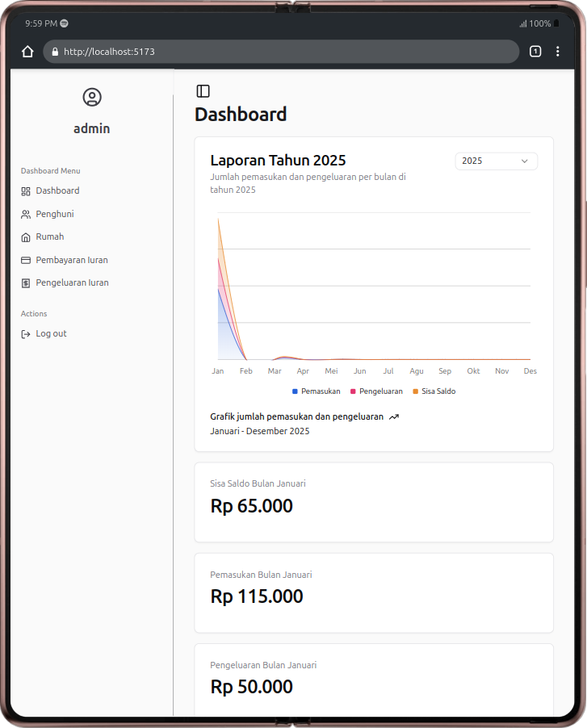
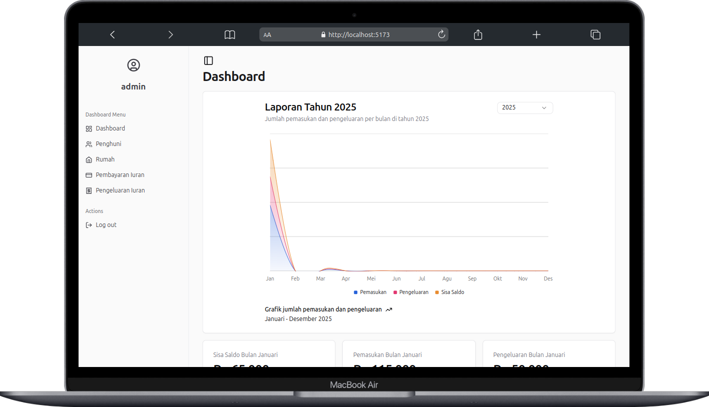

# Before running application
- this app using api from this repository [https://github.com/Garongan/backend-sistem-pengelolaan-iuran](https://github.com/Garongan/backend-sistem-pengelolaan-iuran)
- open git bash terminal and direct to your desired folder
- clone this project
```bash
git clone https://github.com/Garongan/frontend-sistem-pengelolaan-iuran.git
```
- setup environment variable
```bash
cp .env.example .env
```
- install node dependencies
```bash
npm install
```

# How to run preview frontend application
- build with 
```bash
npm run build
```
- run preview with
```bash
npm run preview
```

# How to run development version
- run with
```bash
npm run dev
```

# Note
- you only can login with email `admin@mail.com` and password `password`

.png>)

